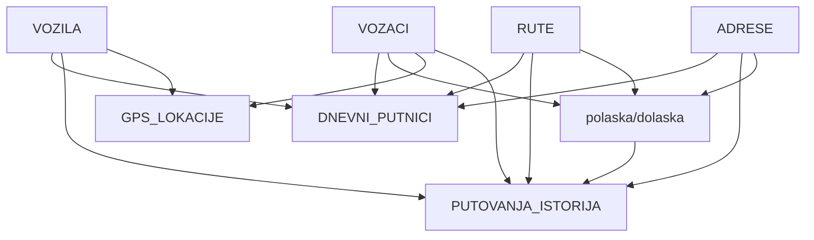

# 📊 Supabase Tabele i Kolone - GAVRA013

## 👨‍✈️ VOZACI

| Kolona | Tip | Opcije | Default | Constraint |
|--------|-----|--------|---------|------------|
| `id` | uuid | Primary Key | gen_random_uuid() | - |
| `ime` | varchar | Required, Unique | - | UNIQUE |
| `email` | varchar | Nullable | - | - |
| `telefon` | varchar | Nullable | - | - |
| `aktivan` | boolean | Nullable | true | - |
| `created_at` | timestamptz | Nullable | now() | - |
| `updated_at` | timestamptz | Nullable | now() | - |
| `kusur` | numeric | Nullable | 0.0 | >= 0 |

---

## 🎫 DNEVNI PUTNICI

| Kolona | Tip | Opcije | Default |
|--------|-----|--------|---------|
| `id` | uuid | Primary Key | gen_random_uuid() |
| `putnik_ime` | varchar | Required | - |
| `telefon` | varchar | Nullable | - |
| `grad` | varchar | Required | - |
| `broj_mesta` | integer | Nullable | - |
| `datum_putovanja` | date | Required | - |
| `vreme_polaska` | varchar | Nullable | - |
| `cena` | numeric | Nullable | - |
| `status` | varchar | Nullable | 'aktivno' |
| `naplatio_vozac_id` | uuid | Nullable, FK | - |
| `pokupio_vozac_id` | uuid | Nullable, FK | - |
| `dodao_vozac_id` | uuid | Nullable, FK | - |
| `otkazao_vozac_id` | uuid | Nullable, FK | - |
| `vozac_id` | uuid | Nullable, FK | - |
| `obrisan` | boolean | Nullable | false |
| `created_at` | timestamptz | Nullable | now() |
| `updated_at` | timestamptz | Nullable | now() |
| `ruta_id` | uuid | Nullable, FK | - |
| `vozilo_id` | uuid | Nullable, FK | - |
| `adresa_id` | uuid | Nullable, FK | - |

---

## 🚐 VOZILA

| Kolona | Tip | Opcije | Default | Constraint |
|--------|-----|--------|---------|------------|
| `id` | uuid | Primary Key | gen_random_uuid() | - |
| `registarski_broj` | varchar | Required, Unique | - | UNIQUE |
| `marka` | varchar | Nullable | - | - |
| `model` | varchar | Nullable | - | - |
| `godina_proizvodnje` | integer | Nullable | - | - |
| `broj_mesta` | integer | Nullable | - | - |
| `aktivan` | boolean | Nullable | true | - |
| `created_at` | timestamptz | Nullable | now() | - |
| `updated_at` | timestamptz | Nullable | now() | - |

---

## 🛣️ RUTE

| Kolona | Tip | Opcije | Default |
|--------|-----|--------|---------|
| `id` | uuid | Primary Key | gen_random_uuid() |
| `naziv` | varchar | Required | - |
| `opis` | text | Nullable | - |
| `aktivan` | boolean | Nullable | true |
| `created_at` | timestamptz | Nullable | now() |
| `updated_at` | timestamptz | Nullable | now() |

---

## 📈 PUTOVANJA ISTORIJA

| Kolona | Tip | Opcije | Default |
|--------|-----|--------|---------|
| `id` | uuid | Primary Key | gen_random_uuid() |
| `mesecni_putnik_id` | uuid | Nullable, FK | - |
| `datum_putovanja` | date | Required | - |
| `vreme_polaska` | varchar | Nullable | - |
| `status` | varchar | Nullable | 'obavljeno' |
| `vozac_id` | uuid | Nullable, FK | - |
| `napomene` | text | Nullable | - |
| `obrisan` | boolean | Nullable | false |
| `created_at` | timestamptz | Nullable | now() |
| `updated_at` | timestamptz | Nullable | now() |
| `ruta_id` | uuid | Nullable, FK | - |
| `vozilo_id` | uuid | Nullable, FK | - |
| `adresa_id` | uuid | Nullable, FK | - |
| `cena` | numeric | Nullable | 0.0 |
| `tip_putnika` | varchar | Nullable | 'dnevni' |
| `putnik_ime` | varchar | Nullable | - |

---

## 📅 MESECNI PUTNICI

| Kolona | Tip | Opcije | Default |
|--------|-----|--------|---------|
| `id` | uuid | Primary Key | gen_random_uuid() |
| `putnik_ime` | varchar | Required | - |
| `tip` | varchar | Required | - |
| `tip_skole` | varchar | Nullable | - |
| `broj_telefona` | varchar | Nullable | - |
| `broj_telefona_oca` | varchar | Nullable | - |
| `broj_telefona_majke` | varchar | Nullable | - |
| `polasci_po_danu` | jsonb | Required | - |
| `adresa_bela_crkva` | text | Nullable | - |
| `adresa_vrsac` | text | Nullable | - |
| `tip_prikazivanja` | varchar | Nullable | 'standard' |
| `radni_dani` | varchar | Nullable | - |
| `aktivan` | boolean | Nullable | true |
| `status` | varchar | Nullable | 'aktivan' |
| `datum_pocetka_meseca` | date | Required | - |
| `datum_kraja_meseca` | date | Required | - |
| `ukupna_cena_meseca` | numeric | Nullable | - |
| `cena` | numeric | Nullable | - |
| `broj_putovanja` | integer | Nullable | 0 |
| `broj_otkazivanja` | integer | Nullable | 0 |
| `poslednje_putovanje` | timestamptz | Nullable | - |
| `vreme_placanja` | timestamptz | Nullable | - |
| `placeni_mesec` | integer | Nullable | - |
| `placena_godina` | integer | Nullable | - |
| `vozac_id` | uuid | Nullable, FK | - |
| `pokupljen` | boolean | Nullable | false |
| `vreme_pokupljenja` | timestamptz | Nullable | - |
| `statistics` | jsonb | Nullable | '{}' |
| `obrisan` | boolean | Nullable | false |
| `created_at` | timestamptz | Nullable | now() |
| `updated_at` | timestamptz | Nullable | now() |
| `ruta_id` | uuid | Nullable, FK | - |
| `vozilo_id` | uuid | Nullable, FK | - |
| `adresa_polaska_id` | uuid | Nullable, FK | - |
| `adresa_dolaska_id` | uuid | Nullable, FK | - |
| `ime` | varchar | Nullable | - |
| `prezime` | varchar | Nullable | - |
| `datum_pocetka` | date | Nullable | - |
| `datum_kraja` | date | Nullable | - |

---

## 🌍 GPS LOKACIJE

| Kolona | Tip | Opcije | Default |
|--------|-----|--------|---------|
| `id` | uuid | Primary Key | gen_random_uuid() |
| `vozac_id` | uuid | Nullable, FK | - |
| `vozilo_id` | uuid | Nullable, FK | - |
| `latitude` | numeric | Required | - |
| `longitude` | numeric | Required | - |
| `brzina` | numeric | Nullable | - |
| `pravac` | numeric | Nullable | - |
| `tacnost` | numeric | Nullable | - |
| `vreme` | timestamptz | Nullable | now() |

---

## 🏠 ADRESE 

| Kolona | Tip | Opcije | Default |
|--------|-----|--------|---------|
| `id` | uuid | Primary Key | gen_random_uuid() |
| `naziv` | varchar | Required | - |
| `grad` | varchar | Nullable | - |
| `ulica` | varchar | Nullable | - |
| `broj` | varchar | Nullable | - |
| `koordinate` | jsonb | Nullable | - |
| `created_at` | timestamptz | Nullable | now() |
| `updated_at` | timestamptz | Nullable | now() |

---

## ✅ DAILY CHECK IN

| Kolona | Tip | Opcije | Default |
|--------|-----|--------|---------|
| `id` | uuid | Primary Key | gen_random_uuid() |
| `vozac` | text | Required | - |
| `datum` | date | Required | - |
| `sitan_novac` | numeric | Nullable | 0.0 |
| `dnevni_pazari` | numeric | Nullable | 0.0 |
| `ukupno` | numeric | Nullable | 0.0 |
| `checkin_vreme` | timestamptz | Nullable | now() |
| `created_at` | timestamptz | Nullable | now() |
| `updated_at` | timestamptz | Nullable | now() |

---

## 🔗 Relacione Veze

## 📊 Ključne Karakteristike

- **🔑 UUID Primary Keys** - Sve tabele koriste UUID kao primarni ključ
- **📅 Audit Trail** - `created_at` i `updated_at` u svim tabelama
- **🗑️ Soft Delete** - `obrisan` boolean flag za logičko brisanje
- **💰 Financial Tracking** - Praćenje finansija kroz više tabela
- **🌐 Geocoding** - JSONB koordinate u ADRESE tabeli
- **📱 Real-time** - GPS tracking sa timestamptz
- **👥 Multi-User** - Različiti vozači za različite operacije
- **📊 Statistics** - JSONB statistike u MESECNI_PUTNICI

## 🎯 Business Logic

### Workflow Putovanja:
1. **Kreiranje** → `dodao_vozac_id`
2. **Pokupljanje** → `pokupio_vozac_id` 
3. **Naplata** → `naplatio_vozac_id`
4. **Otkazivanje** → `otkazao_vozac_id`

### Status Tracking:
- **DNEVNI_PUTNICI**: 'aktivno' / 'otkazano'
- **PUTOVANJA_ISTORIJA**: 'obavljeno' / 'otkazano'
- **MESECNI_PUTNICI**: 'aktivan' / 'neaktivan'